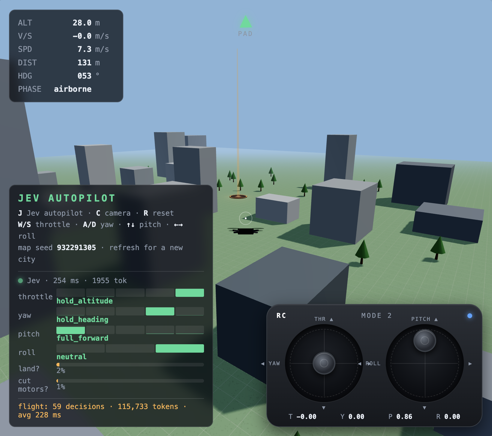

# Drone Sim · Jev Autopilot

A 3D drone simulator built with Three.js, flown autonomously by [TypeSafe](https://typesafe.ai)'s **Jev** model
through the AI SDK's `@ai-sdk/typesafe-ai` provider.

The mission: take off from pad **A**, cross a randomly generated city, land on pad **B**.



## Run it

```bash
npm install
echo "TYPESAFE_AI_API_KEY=your-key" > .env
npm run dev
```

Open http://localhost:5173 and press **J** to hand the sticks to Jev.

## Controls

| Key | Action |
| --- | --- |
| `J` | Toggle Jev autopilot |
| `R` | Reset mission |
| `W` / `S` | Throttle |
| `A` / `D` | Yaw |
| `↑` / `↓` | Pitch (forward / back) |
| `←` / `→` | Roll (left / right) |

A gamepad works too. Touching any stick while Jev is flying gives you control back.
Every refresh generates a new city. The HUD shows the map seed, and `/?seed=<n>` replays one.

## How it works

Jev is not an LLM that writes text. It answers typed questions with calibrated probabilities, in about 200 ms.
So the split is simple:

- **Code does the math.** Altitude, bearing to the pad, speed, obstacles ahead, tallest building on the path.
  It turns those numbers into a short plain-language situation report ([server/pilot.ts](server/pilot.ts)).
- **Jev makes the call.** One request asks six questions about that report: a *Choice* per stick axis
  (throttle, yaw, pitch, roll) and two *Booleans* (commit to landing? cut motors?).
- **Code moves the sticks.** Each answer's probability distribution becomes a stick deflection
  ([src/autopilot.ts](src/autopilot.ts)), with a few hard safety limits kept in code.

After landing, the banner shows total tokens and decisions Jev used for the flight.
